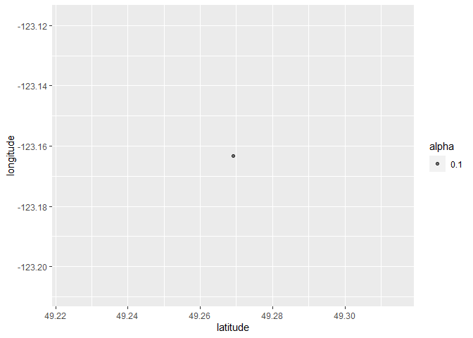
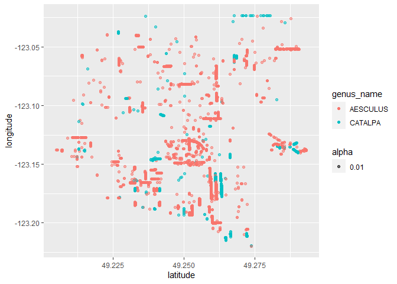
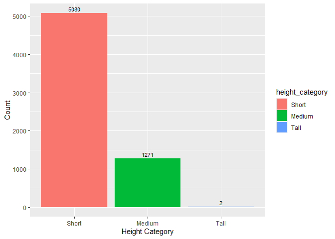
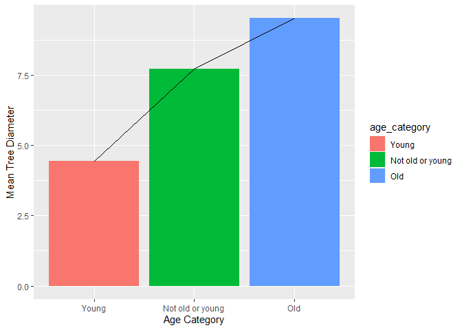
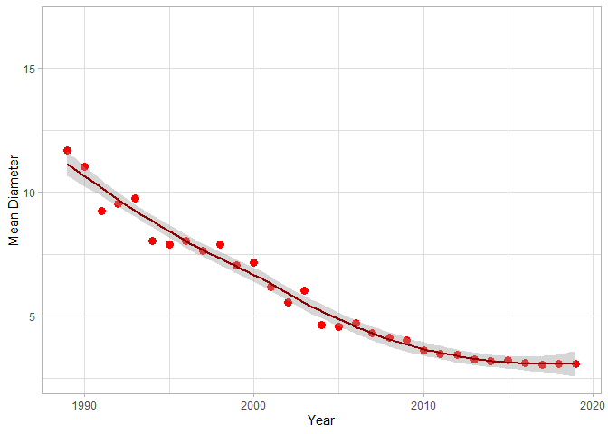

Mini Data Analysis Milestone 2
================

*To complete this milestone, you can either edit [this `.rmd`
file](https://raw.githubusercontent.com/UBC-STAT/stat545.stat.ubc.ca/master/content/mini-project/mini-project-2.Rmd)
directly. Fill in the sections that are commented out with
`<!--- start your work here--->`. When you are done, make sure to knit
to an `.md` file by changing the output in the YAML header to
`github_document`, before submitting a tagged release on canvas.*

# Welcome to the rest of your mini data analysis project!

In Milestone 1, you explored your data. and came up with research
questions. This time, we will finish up our mini data analysis and
obtain results for your data by:

- Making summary tables and graphs
- Manipulating special data types in R: factors and/or dates and times.
- Fitting a model object to your data, and extract a result.
- Reading and writing data as separate files.

We will also explore more in depth the concept of *tidy data.*

**NOTE**: The main purpose of the mini data analysis is to integrate
what you learn in class in an analysis. Although each milestone provides
a framework for you to conduct your analysis, it’s possible that you
might find the instructions too rigid for your data set. If this is the
case, you may deviate from the instructions – just make sure you’re
demonstrating a wide range of tools and techniques taught in this class.

# Instructions

**To complete this milestone**, edit [this very `.Rmd`
file](https://raw.githubusercontent.com/UBC-STAT/stat545.stat.ubc.ca/master/content/mini-project/mini-project-2.Rmd)
directly. Fill in the sections that are tagged with
`<!--- start your work here--->`.

**To submit this milestone**, make sure to knit this `.Rmd` file to an
`.md` file by changing the YAML output settings from
`output: html_document` to `output: github_document`. Commit and push
all of your work to your mini-analysis GitHub repository, and tag a
release on GitHub. Then, submit a link to your tagged release on canvas.

**Points**: This milestone is worth 50 points: 45 for your analysis, and
5 for overall reproducibility, cleanliness, and coherence of the Github
submission.

**Research Questions**: In Milestone 1, you chose two research questions
to focus on. Wherever realistic, your work in this milestone should
relate to these research questions whenever we ask for justification
behind your work. In the case that some tasks in this milestone don’t
align well with one of your research questions, feel free to discuss
your results in the context of a different research question.

# Learning Objectives

By the end of this milestone, you should:

- Understand what *tidy* data is, and how to create it using `tidyr`.
- Generate a reproducible and clear report using R Markdown.
- Manipulating special data types in R: factors and/or dates and times.
- Fitting a model object to your data, and extract a result.
- Reading and writing data as separate files.

# Setup

Begin by loading your data and the tidyverse package below:

``` r
library(datateachr) # <- might contain the data you picked!
library(tidyverse)
```

    ## Warning: package 'tidyverse' was built under R version 4.2.3

    ## Warning: package 'ggplot2' was built under R version 4.2.3

    ## Warning: package 'readr' was built under R version 4.2.3

    ## Warning: package 'lubridate' was built under R version 4.2.3

``` r
library(forcats)
library(lubridate)
library(broom)
```

    ## Warning: package 'broom' was built under R version 4.2.3

``` r
library(here)
```

    ## Warning: package 'here' was built under R version 4.2.3

# Task 1: Process and summarize your data

From milestone 1, you should have an idea of the basic structure of your
dataset (e.g. number of rows and columns, class types, etc.). Here, we
will start investigating your data more in-depth using various data
manipulation functions.

### 1.1 (1 point)

First, write out the 4 research questions you defined in milestone 1
were. This will guide your work through milestone 2:

<!-------------------------- Start your work below ---------------------------->

1.  *What is the geographical distribution of the tree genus with the
    largest average diameter? (latitude and longitude)*
2.  *What is the number of trees in Marpole and Kensington-Cedar cottage
    that have and don’t have a root barrier?*
3.  *What is the distribution of height ranges of trees in Marpole?*
4.  *What is the relationship between the date the tree was planted and
    the tree diameter?*
    <!----------------------------------------------------------------------------->

Here, we will investigate your data using various data manipulation and
graphing functions.

### 1.2 (8 points)

Now, for each of your four research questions, choose one task from
options 1-4 (summarizing), and one other task from 4-8 (graphing). You
should have 2 tasks done for each research question (8 total). Make sure
it makes sense to do them! (e.g. don’t use a numerical variables for a
task that needs a categorical variable.). Comment on why each task helps
(or doesn’t!) answer the corresponding research question.

Ensure that the output of each operation is printed!

Also make sure that you’re using dplyr and ggplot2 rather than base R.
Outside of this project, you may find that you prefer using base R
functions for certain tasks, and that’s just fine! But part of this
project is for you to practice the tools we learned in class, which is
dplyr and ggplot2.

**Summarizing:**

1.  Compute the *range*, *mean*, and *two other summary statistics* of
    **one numerical variable** across the groups of **one categorical
    variable** from your data.
2.  Compute the number of observations for at least one of your
    categorical variables. Do not use the function `table()`!
3.  Create a categorical variable with 3 or more groups from an existing
    numerical variable. You can use this new variable in the other
    tasks! *An example: age in years into “child, teen, adult, senior”.*
4.  Compute the proportion and counts in each category of one
    categorical variable across the groups of another categorical
    variable from your data. Do not use the function `table()`!

**Graphing:**

6.  Create a graph of your choosing, make one of the axes logarithmic,
    and format the axes labels so that they are “pretty” or easier to
    read.
7.  Make a graph where it makes sense to customize the alpha
    transparency.

Using variables and/or tables you made in one of the “Summarizing”
tasks:

8.  Create a graph that has at least two geom layers.
9.  Create 3 histograms, with each histogram having different sized
    bins. Pick the “best” one and explain why it is the best.

Make sure it’s clear what research question you are doing each operation
for!

<!------------------------- Start your work below ----------------------------->

``` r
#Question 1: What is the geographical distribution of the tree genus with the largest average diameter? (latitude and longitude)
# In terms of the summarizing, I will pick option 1. This helps me answer the research question because it allows me to group the information by genus, and then find the average diameter, along with a set of other useful information
summarized_data <- vancouver_trees %>%
  group_by(genus_name) %>%
  summarise(mean = mean(diameter),
            st_dev= sd(diameter),
            max_diameter= max(diameter),
            min_diameter= min(diameter),
            range= range(diameter))
```

    ## Warning: Returning more (or less) than 1 row per `summarise()` group was deprecated in
    ## dplyr 1.1.0.
    ## ℹ Please use `reframe()` instead.
    ## ℹ When switching from `summarise()` to `reframe()`, remember that `reframe()`
    ##   always returns an ungrouped data frame and adjust accordingly.
    ## Call `lifecycle::last_lifecycle_warnings()` to see where this warning was
    ## generated.

``` r
# in terms of the graphing, I will pick option 7. This will allow me to answer the research question because it allos me to generate a scatter plot depicting the lattude and longitudinal spread of the trees. The alpha transparency allow me to identify points that overlap with eachother in the plot.
max_dimeter_genus <- filter(summarized_data, mean== max(mean)) 
max_diameter_genus_filtered_vancouver_trees <- vancouver_trees %>% 
  filter(genus_name == "CUPRESSOCYPARIS   X") %>%
  ggplot(aes(x=latitude, y=longitude))+ geom_point(aes(alpha=0.1))
plot(max_diameter_genus_filtered_vancouver_trees)
```

    ## Warning: Removed 1 rows containing missing values (`geom_point()`).

<!-- -->

``` r
## Unfortunately, the dataset has only one tree according to these filtering options only 1 tree exists. To make the answer make sense, I will plot the top 3 genera with the max average diameters
top_3_max_dimater <- summarized_data %>%
  arrange(desc(mean))

top_3_diameter_results <- top_3_max_dimater[1:3,] 

 vancouver_trees %>%
  filter(genus_name=="CUPRESSOCYPARIS  X"| genus_name=="AESCULUS" | genus_name=="CATALPA")%>%
  ggplot(aes(x=latitude, y=longitude, color=genus_name))+ geom_point(aes(alpha=0.01))
```

    ## Warning: Removed 351 rows containing missing values (`geom_point()`).

<!-- -->

``` r
 #Question 2: What is the number of trees in Marpole and Kensington-Cedar cottage that have and don't have a root barrier?
 # Summarizing, I will pick option 2. This will help me answer the reserach question because it would let me count the categorical observations (Yes/No)
 
kensington_Marpole <- vancouver_trees %>%
  filter(neighbourhood_name=="MARPOLE" | neighbourhood_name=="KENSINGTON-CEDAR COTTAGE")

# Now we count the number of trees that have and don't have a root barrier for these dataset
count_data_kensington_marpole <- kensington_Marpole %>% 
  group_by(neighbourhood_name, root_barrier)%>% 
  summarize(count= n())
```

    ## `summarise()` has grouped output by 'neighbourhood_name'. You can override
    ## using the `.groups` argument.

``` r
#For  the graphing, I will pick option 8. This allows me to plot the data as a bar plot, while using an additional geom layer to depict the number of counts for each category.
ggplot(count_data_kensington_marpole, aes(x=neighbourhood_name, y=count)) + geom_col(aes(fill=root_barrier), position="dodge")+  geom_text(aes(label = count), vjust = -0.5, size = 3) +labs(x="Neighbourhood Name", y="Count")
```

<!-- -->

``` r
#Question 3: What is the distribution of height ranges of trees in Marpole?

# For the summarizing, I will make a categorical variable of tall, medium, and short trees (option 3). This will make the analysis easier as it allows me to understand the distribution of tree heights on a broader scale.

Height_trees <- vancouver_trees%>%
  filter(!is.na(height_range_id)) %>%
  mutate(height_category = factor(case_when(height_range_id <= 3 ~ "Short", 
                                         height_range_id <=7 ~ "Medium", 
                                         height_range_id <11 ~ "Tall"), c("Short", "Medium", "Tall") ))

# for the graphing, I will choose option 8. This allows me to generate a bar plot of the height categories, and add an additional layer of counts to see how many trees in Marple fal in each height category
  Height_trees %>%
  filter(neighbourhood_name=="MARPOLE")%>%
  group_by(height_category) %>%
  summarize(count=n())%>%
  ggplot(aes(x=height_category, y=count)) + geom_col(aes(fill=height_category)) + 
  geom_text(aes(label = count), vjust = -0.5, size = 3)+ labs(x="Height Category", y= "Count")
```

<!-- -->

``` r
#Question 4: What is the relationship between the date the tree was planted and the tree diameter?
# For the summarizing, I will pick option 3. This will help me answre the research question because I will be able to create categorical bins of the tree ages that will allow to relate t better to the diameter of the trees of that age.

filtered_trees_age <- vancouver_trees%>%
  filter(!is.na(date_planted)) %>%
  mutate(age_category = factor(case_when(date_planted <= "1995-01-01" ~ "Old",
                                         date_planted >"1995-01-01" & date_planted <="2000-01-01" ~ 'Not old or young', 
                             TRUE ~ "Young"),c("Young", "Not old or young", "Old")))


# for the graphing, I will plot the different age ranges (option 8).This allows me to generate a bar plot of the age categories, and add an additional layer (line) to observe the trend in tree diameter across the age categories
filtered_trees_age %>%
  group_by(age_category) %>%
  summarize(mean_diameter= mean(diameter))%>%
  ggplot(aes(x=age_category, y=mean_diameter)) + geom_col(aes(fill=age_category)) + geom_line(aes(x=as.numeric(age_category)))+ labs(x="Age Category", y="Mean Tree Diameter")
```

<!-- -->

<!----------------------------------------------------------------------------->

### 1.3 (2 points)

Based on the operations that you’ve completed, how much closer are you
to answering your research questions? Think about what aspects of your
research questions remain unclear. Can your research questions be
refined, now that you’ve investigated your data a bit more? Which
research questions are yielding interesting results?

<!------------------------- Write your answer here ---------------------------->

Based on the operations I have completed, I would say that I am quite
close to answering my research questions. In terms of the questions
where I made categorical bins, I believe that I can dive deeper into the
variability of the tree height/ diameter across genera or neighborhood
streets for example. I believe that the relationship between the date
the tree was planted and the tree diameter is living interesting
results. My research questions can be more refined by focusing on a
subcategory within l larger category I defined, such as “Old” or “Tall”
trees.
<!----------------------------------------------------------------------------->

# Task 2: Tidy your data

In this task, we will do several exercises to reshape our data. The goal
here is to understand how to do this reshaping with the `tidyr` package.

A reminder of the definition of *tidy* data:

- Each row is an **observation**
- Each column is a **variable**
- Each cell is a **value**

### 2.1 (2 points)

Based on the definition above, can you identify if your data is tidy or
untidy? Go through all your columns, or if you have \>8 variables, just
pick 8, and explain whether the data is untidy or tidy.

<!--------------------------- Start your work below
--------------------------->

The data from the Vancouver Trees data set is tidy because each row has
a single observation, each column has a single variable and each cell
has a value (even though some are ‘NA’ values)
<!----------------------------------------------------------------------------->

### 2.2 (4 points)

Now, if your data is tidy, untidy it! Then, tidy it back to it’s
original state.

If your data is untidy, then tidy it! Then, untidy it back to it’s
original state.

Be sure to explain your reasoning for this task. Show us the “before”
and “after”.

<!--------------------------- Start your work below --------------------------->

Since my data is already tidy, I am going to untidy it. To do this, I
will put all the name categories into single column using pivot_longer

``` r
#Before:
view(vancouver_trees)
```

``` r
#After:
untidy_vancouver_trees<- pivot_longer(vancouver_trees, cols= ends_with("name"), names_to= "Class_of_Tree", values_to = "Name")
view(untidy_vancouver_trees)
```

``` r
#Make the data tidy again:
Tidy_trees <- pivot_wider(untidy_vancouver_trees, names_from = "Class_of_Tree", values_from = "Name")
view(Tidy_trees)
```

In the first case, we chose to untidy our data because it allows us to
analyse variables that would otherwise be difficult to when the data is
tidy, like specific classes of trees and other variables. Similarly when
I tidy the data it helps me to compare variable that I otherwise would
not be able to such as neighbourhood name to other variables.
<!----------------------------------------------------------------------------->

### 2.3 (4 points)

Now, you should be more familiar with your data, and also have made
progress in answering your research questions. Based on your interest,
and your analyses, pick 2 of the 4 research questions to continue your
analysis in the remaining tasks:

<!-------------------------- Start your work below ---------------------------->

1.  *What is the relationship between the date the tree was planted and
    the tree diameter-In specific what is the distribution of the
    average tree diameter across genera within the old age category*
2.  *What is the distribution of tree diameter of trees in different
    streets in Marpole?- In specific, how are the different trees spread
    across different streets in Marpole*

<!----------------------------------------------------------------------------->

Explain your decision for choosing the above two research questions.

<!--------------------------- Start your work below --------------------------->

In terms of Q1, I decided to keep exploring the relationship between
tree diameter and the date the tree was planted, because it seems like
there is a big range of trees within each age category I defined. I
think it would be interesting to explore how much variability exists
across different genera within an age group(The old age group).I chose
the old age group since it had the greatest average tree diameter
according to the graph I made previously

In terms of Q2, I think it would be interesting to explore the
distribution of different trees across the various streets. When looking
at the distribution of the tree height ranges, there seems to be a range
of trees in different height categories. I want to explore how these
height categories are distributes across the different streets in
Marpole.
<!----------------------------------------------------------------------------->

Now, try to choose a version of your data that you think will be
appropriate to answer these 2 questions. Use between 4 and 8 functions
that we’ve covered so far (i.e. by filtering, cleaning, tidy’ing,
dropping irrelevant columns, etc.).

(If it makes more sense, then you can make/pick two versions of your
data, one for each research question.)

<!--------------------------- Start your work below
--------------------------->

``` r
##Q1 What is the distributon of the average tree diameter across genera within the old age category

old_trees_only <- filter(filtered_trees_age, age_category=="Old") %>%
  select(c(diameter,genus_name))%>%
  group_by(genus_name)%>%
  summarize(mean_diameter= mean(diameter)) %>%
  mutate(diameter_category = case_when(
    mean_diameter <= 10 ~ "thin",
    mean_diameter <= 20 & mean_diameter > 10 ~ "medium",
    mean_diameter > 20 ~ "thick"
  )) %>%
  ggplot(aes(x=genus_name, y=mean_diameter, fill = diameter_category)) +
  geom_col() +
  theme_bw() +
  theme(axis.text.x = element_text(angle = 90, hjust = 1))+ labs(x="Genus name", y="Mean Diameter")

plot(old_trees_only)
```

<!-- -->

``` r
#Q2:What is the distribution of trees of different height categories (self-defined) in different streets in Marpole?

Marpole_dataset <- select(vancouver_trees, c(genus_name, neighbourhood_name, on_street, height_range_id)) %>%
  filter(neighbourhood_name=="MARPOLE") %>%
  group_by(on_street)%>%
  summarize(mean_height= mean(height_range_id))%>%
  mutate(height_category = case_when(
    mean_height <= 2 ~ "Short",
    mean_height <= 3 & mean_height > 2 ~ "Medium",
    mean_height >= 3 ~ "Tall"))

plot_Marpole <- ggplot(Marpole_dataset, aes(x=on_street, y=mean_height))+ geom_col(aes(fill= height_category))+
  theme_bw()+
  theme(axis.text.x = element_text(size=9, angle = 90, hjust = 1))+ labs(x="Street Name", y="Mean Height")

plot(plot_Marpole)
```

<!-- -->

# Task 3: Modelling

## 3.0 (no points)

Pick a research question from 1.2, and pick a variable of interest
(we’ll call it “Y”) that’s relevant to the research question. Indicate
these.

<!-------------------------- Start your work below ---------------------------->

**Research Question**: What is the relationship between the date the
tree was planted and the tree diameter?

**Variable of interest**: Diameter of tree of trees

<!----------------------------------------------------------------------------->

## 3.1 (3 points)

Fit a model or run a hypothesis test that provides insight on this
variable with respect to the research question. Store the model object
as a variable, and print its output to screen. We’ll omit having to
justify your choice, because we don’t expect you to know about model
specifics in STAT 545.

- **Note**: It’s OK if you don’t know how these models/tests work. Here
  are some examples of things you can do here, but the sky’s the limit.

  - You could fit a model that makes predictions on Y using another
    variable, by using the `lm()` function.
  - You could test whether the mean of Y equals 0 using `t.test()`, or
    maybe the mean across two groups are different using `t.test()`, or
    maybe the mean across multiple groups are different using `anova()`
    (you may have to pivot your data for the latter two).
  - You could use `lm()` to test for significance of regression
    coefficients.

<!-------------------------- Start your work below ---------------------------->

``` r
Tree_by_year <- vancouver_trees %>%
 mutate(year_planted = year(date_planted))%>%
  group_by(year_planted) %>%
  summarize(mean_diameter= mean(diameter))

ggplot(Tree_by_year, aes(x= year_planted, y = mean_diameter))+ 
  geom_point(size = 3, colour = 'red')+ 
  theme_light()+
  geom_smooth(color = 'darkred')+
  labs(y = "Mean Diameter", 
       x = "Year") 
```

    ## `geom_smooth()` using method = 'loess' and formula = 'y ~ x'

    ## Warning: Removed 1 rows containing non-finite values (`stat_smooth()`).

    ## Warning: Removed 1 rows containing missing values (`geom_point()`).

<!-- -->

``` r
#Fit the model to the graph
model_lm <- lm(mean_diameter ~year_planted,Tree_by_year)
```

<!----------------------------------------------------------------------------->

## 3.2 (3 points)

Produce something relevant from your fitted model: either predictions on
Y, or a single value like a regression coefficient or a p-value.

- Be sure to indicate in writing what you chose to produce.
- Your code should either output a tibble (in which case you should
  indicate the column that contains the thing you’re looking for), or
  the thing you’re looking for itself.
- Obtain your results using the `broom` package if possible. If your
  model is not compatible with the broom function you’re needing, then
  you can obtain your results by some other means, but first indicate
  which broom function is not compatible.

<!-------------------------- Start your work below ---------------------------->

``` r
#Summary of the regression model
summary(model_lm)
```

    ## 
    ## Call:
    ## lm(formula = mean_diameter ~ year_planted, data = Tree_by_year)
    ## 
    ## Residuals:
    ##     Min      1Q  Median      3Q     Max 
    ## -1.1978 -0.5456 -0.1742  0.3864  1.6774 
    ## 
    ## Coefficients:
    ##               Estimate Std. Error t value Pr(>|t|)    
    ## (Intercept)  561.99730   29.63195   18.97   <2e-16 ***
    ## year_planted  -0.27751    0.01479  -18.77   <2e-16 ***
    ## ---
    ## Signif. codes:  0 '***' 0.001 '**' 0.01 '*' 0.05 '.' 0.1 ' ' 1
    ## 
    ## Residual standard error: 0.7363 on 29 degrees of freedom
    ##   (1 observation deleted due to missingness)
    ## Multiple R-squared:  0.9239, Adjusted R-squared:  0.9213 
    ## F-statistic: 352.2 on 1 and 29 DF,  p-value: < 2.2e-16

``` r
#Predicted tree diameter in 2021
new_data <- data.frame(year_planted = c(2021, 2022))
predictions <- predict(model_lm, newdata= new_data)

# According to the model, the average tree diameter will be 1.146 in 2021 and 0.868 in 2022
```

<!----------------------------------------------------------------------------->

# Task 4: Reading and writing data

Get set up for this exercise by making a folder called `output` in the
top level of your project folder / repository. You’ll be saving things
there.

## 4.1 (3 points)

Take a summary table that you made from Task 1, and write it as a csv
file in your `output` folder. Use the `here::here()` function.

- **Robustness criteria**: You should be able to move your Mini Project
  repository / project folder to some other location on your computer,
  or move this very Rmd file to another location within your project
  repository / folder, and your code should still work.
- **Reproducibility criteria**: You should be able to delete the csv
  file, and remake it simply by knitting this Rmd file.

<!-------------------------- Start your work below ---------------------------->

``` r
write_csv(summarized_data, here::here("output", "summarized_data.csv"))
```

<!----------------------------------------------------------------------------->

## 4.2 (3 points)

Write your model object from Task 3 to an R binary file (an RDS), and
load it again. Be sure to save the binary file in your `output` folder.
Use the functions `saveRDS()` and `readRDS()`.

- The same robustness and reproducibility criteria as in 4.1 apply here.

<!-------------------------- Start your work below ---------------------------->

``` r
# Save model as R object
saveRDS(model_lm, here::here("output", "task3_model.rds"))

# Read RDS object
readRDS(here::here("output", "task3_model.rds"))
```

    ## 
    ## Call:
    ## lm(formula = mean_diameter ~ year_planted, data = Tree_by_year)
    ## 
    ## Coefficients:
    ##  (Intercept)  year_planted  
    ##     561.9973       -0.2775

<!----------------------------------------------------------------------------->

# Overall Reproducibility/Cleanliness/Coherence Checklist

Here are the criteria we’re looking for.

## Coherence (0.5 points)

The document should read sensibly from top to bottom, with no major
continuity errors.

The README file should still satisfy the criteria from the last
milestone, i.e. it has been updated to match the changes to the
repository made in this milestone.

## File and folder structure (1 points)

You should have at least three folders in the top level of your
repository: one for each milestone, and one output folder. If there are
any other folders, these are explained in the main README.

Each milestone document is contained in its respective folder, and
nowhere else.

Every level-1 folder (that is, the ones stored in the top level, like
“Milestone1” and “output”) has a `README` file, explaining in a sentence
or two what is in the folder, in plain language (it’s enough to say
something like “This folder contains the source for Milestone 1”).

## Output (1 point)

All output is recent and relevant:

- All Rmd files have been `knit`ted to their output md files.
- All knitted md files are viewable without errors on Github. Examples
  of errors: Missing plots, “Sorry about that, but we can’t show files
  that are this big right now” messages, error messages from broken R
  code
- All of these output files are up-to-date – that is, they haven’t
  fallen behind after the source (Rmd) files have been updated.
- There should be no relic output files. For example, if you were
  knitting an Rmd to html, but then changed the output to be only a
  markdown file, then the html file is a relic and should be deleted.

Our recommendation: delete all output files, and re-knit each
milestone’s Rmd file, so that everything is up to date and relevant.

## Tagged release (0.5 point)

You’ve tagged a release for Milestone 2.

### Attribution

Thanks to Victor Yuan for mostly putting this together.
